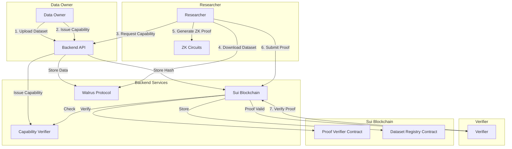

# Zero-Knowledge Medical Dataset Access System - Implementation Plan

## System Architecture Overview



## Component Breakdown

### 1. Sui Move Contracts (`move/`)

#### 1.1 Dataset Registry Contract (`move/dataset_registry/sources/DatasetRegistry.move`)

- **Purpose**: Store dataset commitments (hashes) on-chain
- **Key Functions**:
                                - `register_dataset(blob_id: String, dataset_hash: vector<u8>, owner: address, ctx: &mut TxContext)`: Register dataset hash on-chain
                                - `get_dataset_hash(blob_id: String): Option<vector<u8>>`: Retrieve dataset hash
                                - `verify_dataset_exists(blob_id: String): bool`: Verify dataset is registered
- **Structs**:
                                - `DatasetRecord`: Contains `blob_id`, `dataset_hash`, `owner`, `timestamp`
- **Storage**: Uses Sui's `Table` or `Bag` for blob_id → DatasetRecord mapping

#### 1.2 Capability Registry Contract (`move/capability_registry/sources/CapabilityRegistry.move`)

- **Purpose**: Verify capabilities on-chain (capabilities issued off-chain, verified on-chain)
- **Key Functions**:
                                - `verify_capability(capability_id: String, dataset_id_hash: u256, allowed_query: vector<u8>, signature: vector<u8>): bool`: Verify capability signature
                                - `check_capability_valid(capability_id: String, dataset_id_hash: u256): bool`: Check if capability is valid for dataset
- **Structs**:
                                - `Capability`: Contains `id`, `dataset_id_hash`, `allowed_query_hash`, `expires_at`, `issuer`
- **Note**: Capabilities are issued off-chain but verified on-chain using cryptographic signatures

#### 1.3 Proof Verifier Contract (`move/proof_verifier/sources/ProofVerifier.move`)

- **Purpose**: Verify Groth16 ZK proofs on-chain using Sui's `groth16` module
- **Key Functions**:
                                - `verify_proof(proof_points: vector<u8>, public_inputs: vector<u8>, verifying_key_id: u8, ctx: &mut TxContext)`: Verify ZK proof
                                - `register_verifying_key(circuit_id: String, vk_bytes: vector<u8>, ctx: &mut TxContext)`: Register verification keys for different circuits
                                - `submit_proof_result(proof_id: String, blob_id: String, public_output: vector<u8>, proof_points: vector<u8>, public_inputs: vector<u8>, ctx: &mut TxContext)`: Submit and verify proof, store result
- **Structs**:
                                - `ProofResult`: Contains `proof_id`, `blob_id`, `public_output`, `verified_at`, `verifier_address`
                                - `VerifyingKey`: Stores prepared verifying keys for different circuits
- **Integration**: Uses `sui::groth16` for on-chain proof verification (BN254 curve for Circom compatibility)

#### 1.4 Verifier Contract (`move/verifier/sources/Verifier.move`)

- **Purpose**: Allow verifiers to query proof results
- **Key Functions**:
                                - `get_proof_result(proof_id: String): Option<ProofResult>`: Retrieve verified proof result
                                - `list_proofs_by_dataset(blob_id: String): vector<ProofResult>`: List all proofs for a dataset
- **Events**: Emit events when proofs are verified

### 2. Backend Services (`controllers/`, `routes/`, `utils/`)

#### 2.1 Dataset Upload Service (`controllers/uploadDatasetController.js`)

- **Current State**: Basic upload exists, needs enhancement
- **Enhancements**:
                                - Encrypt dataset before upload (AES-256-GCM)
                                - Compute dataset hash (Poseidon hash) for on-chain commitment
                                - Upload encrypted dataset to Walrus protocol
                                - Register dataset hash on Sui blockchain via Move contract
                                - Return `blob_id` and `dataset_hash` to owner
- **Integration**: 
                                - Uses `utils/walrus.mjs` for Walrus upload
                                - Calls Sui Move contract `register_dataset` function

#### 2.2 Capability Issuance Service (`controllers/capabilityController.js`)

- **Current State**: Basic capability registry exists
- **Enhancements**:
                                - Issue capabilities with cryptographic signatures (ECDSA/Ed25519)
                                - Define capability structure: `{capability_id, dataset_id_hash, allowed_query_type, query_params, expires_at, issuer_signature}`
                                - Store capabilities off-chain in `capabilityRegistry.js`
                                - Support multiple query types: aggregates, ranges, conditions, custom
- **Capability Structure**:
  ```javascript
  {
    id: string,
    dataset_id_hash: u256,
    query_type: 'aggregate' | 'range' | 'condition' | 'custom',
    query_params: object, // e.g., {field: 'age', operator: '>', value: 18}
    expires_at: timestamp,
    issuer: address,
    signature: bytes
  }
  ```


#### 2.3 Proof Generation Service (`controllers/proofGenerationController.js`)

- **Current State**: Multiple proof controllers exist, needs consolidation
- **Enhancements**:
                                - Unified proof generation endpoint that routes to appropriate circuit based on `proof_type`
                                - Download dataset from Walrus using `blob_id`
                                - Decrypt dataset (if encrypted)
                                - Validate capability before proof generation
                                - Generate witness using Circom circuits
                                - Generate Groth16 proof using snarkjs
                                - Return proof, public inputs, and public outputs
- **Proof Types Supported**:
                                - `count_aggregate`: Count records matching condition
                                - `sum_aggregate`: Sum of field values
                                - `range_query`: Records within range
                                - `condition_query`: Records matching condition
                                - `custom_query`: Custom circuit-based queries

#### 2.4 Proof Submission Service (`controllers/proofSubmissionController.js`)

- **Purpose**: Submit proofs to Sui blockchain for on-chain verification
- **Functions**:
                                - Format proof for Sui Move contract (convert JSON proof to bytes)
                                - Prepare verifying key bytes
                                - Call `submit_proof_result` Move function
                                - Handle transaction results and errors
- **Integration**: Uses Sui TypeScript SDK to interact with Move contracts

#### 2.5 API Routes (`routes/`)

- **Dataset Routes** (`routes/datasets.js`):
                                - `POST /datasets/upload`: Upload dataset (enhanced)
                                - `GET /datasets/:blobId`: Get dataset metadata
                                - `GET /datasets`: List datasets (owner only)
- **Capability Routes** (`routes/capabilities.js`):
                                - `POST /capabilities/issue`: Issue capability (enhanced)
                                - `GET /capabilities/:id`: Get capability details
                                - `GET /capabilities`: List capabilities
- **Proof Routes** (`routes/proofs.js`):
                                - `POST /proofs/generate`: Generate ZK proof
                                - `POST /proofs/submit`: Submit proof to blockchain
                                - `GET /proofs/:proofId`: Get proof status
- **Verifier Routes** (`routes/verifier.js`):
                                - `GET /verifier/proofs/:proofId`: Get verified proof result
                                - `GET /verifier/datasets/:blobId/proofs`: List all proofs for dataset

### 3. Zero-Knowledge Circuits (`circuits/`)

#### 3.1 Aggregate Proof Circuits

- **Count Circuit** (`circuits/aggregate_count.circom`):
                                - Input: dataset records, condition
                                - Output: count of records matching condition
                                - Example: Count patients with age > 18
- **Sum Circuit** (`circuits/aggregate_sum.circom`):
                                - Input: dataset records, field index
                                - Output: sum of field values
- **Average Circuit** (`circuits/aggregate_avg.circom`):
                                - Input: dataset records, field index
                                - Output: average of field values

#### 3.2 Range Query Circuits

- **Range Count Circuit** (`circuits/range_count.circom`):
                                - Input: dataset records, field index, min_value, max_value
                                - Output: count of records in range
- **Range Sum Circuit** (`circuits/range_sum.circom`):
                                - Input: dataset records, field index, min_value, max_value
                                - Output: sum of records in range

#### 3.3 Condition Query Circuits

- **Condition Count Circuit** (`circuits/condition_count.circom`):
                                - Input: dataset records, condition (field + operator + value)
                                - Output: count matching condition
- **Multi-Condition Circuit** (`circuits/multi_condition.circom`):
                                - Input: dataset records, multiple conditions (AND/OR)
                                - Output: count matching all/any conditions

#### 3.4 Capability-Bound Circuits

- **Capability Bound Circuit** (`circuits/capability_bound.circom`):
                                - Input: dataset records, capability_hash, query_params
                                - Output: proof that query matches capability
                                - Ensures researcher can only prove what capability allows

#### 3.5 Merkle Tree Circuits (for large datasets)

- **Merkle Proof Circuit** (`circuits/merkle_proof.circom`):
                                - Input: Merkle root, leaf data, Merkle path
                                - Output: proof that leaf is in tree
                                - Enables proving properties of large datasets without processing all records

### 4. Frontend Interface (`frontend/`)

#### 4.1 Data Owner Interface (`frontend/owner.html`)

- **Features**:
                                - Upload dataset (file upload)
                                - View uploaded datasets (blob_id, hash, timestamp)
                                - Issue capabilities to researchers
                                - Set capability parameters (query type, expiration)
- **Integration**: Calls backend `/datasets/upload` and `/capabilities/issue`

#### 4.2 Researcher Interface (`frontend/researcher.html`)

- **Features**:
                                - View available capabilities
                                - Select capability and dataset
                                - Generate proof (calls `/proofs/generate`)
                                - Submit proof to blockchain (calls `/proofs/submit`)
                                - View proof status and results
- **Integration**: Calls backend proof generation and submission endpoints

#### 4.3 Verifier Interface (`frontend/verifier.html`)

- **Features**:
                                - Query proof by proof_id
                                - Query all proofs for a dataset
                                - View proof results (public outputs)
                                - Verify proof validity (on-chain verification status)
- **Integration**: Calls backend verifier routes and Sui blockchain directly

### 5. Utilities and Helpers (`utils/`)

#### 5.1 Walrus Integration (`utils/walrus.mjs`)

- **Current State**: Basic functions exist
- **Enhancements**:
                                - `storeBlob(filePath, walletPath)`: Upload to Walrus (enhanced error handling)
                                - `readBlob(blobId, outputPath, walletPath)`: Download from Walrus
                                - `getBlobMetadata(blobId)`: Get blob metadata

#### 5.2 Sui Integration (`utils/sui.mjs`)

- **New File**: Sui blockchain interaction utilities
- **Functions**:
                                - `getSuiClient()`: Initialize Sui client
                                - `callMoveFunction(packageId, module, function, args, signer)`: Call Move function
                                - `prepareProofForSui(proofJson)`: Convert snarkjs proof to Sui format
                                - `prepareVerifyingKeyForSui(vkeyJson)`: Convert verification key to Sui format

#### 5.3 Cryptographic Utilities (`utils/crypto.mjs`)

- **Functions**:
                                - `hashDataset(dataset)`: Compute Poseidon hash of dataset
                                - `signCapability(capability, privateKey)`: Sign capability
                                - `verifyCapabilitySignature(capability, publicKey)`: Verify capability signature
                                - `encryptDataset(dataset, key)`: Encrypt dataset (AES-256-GCM)
                                - `decryptDataset(encryptedData, key, iv)`: Decrypt dataset

#### 5.4 Proof Utilities (`utils/proof.mjs`)

- **Functions**:
                                - `generateWitness(circuitWasm, inputJson, witnessPath)`: Generate witness
                                - `generateProof(zkeyPath, witnessPath)`: Generate Groth16 proof
                                - `formatProofForSui(proofJson)`: Format proof for Sui Move contract
                                - `formatPublicInputsForSui(publicSignals)`: Format public inputs for Sui

### 6. Configuration and Setup

#### 6.1 Environment Configuration (`.env`)

- `NODE_ENV`: Environment (production/development)
- `PORT`: Backend server port (default: 3000)
- `SUI_NETWORK`: Sui network (devnet/testnet/mainnet)
- `SUI_WALLET_PATH`: Path to Sui wallet (default: `~/.sui/sui_config/client.yaml`)
- `WALRUS_CLI_PATH`: Path to Walrus CLI (default: `/usr/local/bin/walrus`)
- `CIRCUITS_DIR`: Path to Circom circuits directory (default: `./circuits`)
- `ZKEY_DIR`: Path to zkey files directory (default: `./circuits`)
- `DATA_DIR`: Path to data directory (default: `./data`)
- `CLOUDFLARE_TUNNEL_ID`: Cloudflare tunnel ID (optional)
- `CLOUDFLARE_TUNNEL_CREDENTIALS_PATH`: Path to tunnel credentials file (optional)

#### 6.2 Move Package Configuration

- **Dataset Registry** (`move/dataset_registry/Move.toml`):
                                - Dependencies: Sui framework, Move stdlib
- **Capability Registry** (`move/capability_registry/Move.toml`):
                                - Dependencies: Sui framework, Move stdlib, crypto modules
- **Proof Verifier** (`move/proof_verifier/Move.toml`):
                                - Dependencies: Sui framework, `sui::groth16` module
- **Verifier** (`move/verifier/Move.toml`):
                                - Dependencies: Sui framework, proof_verifier module

### 7. Data Flow

#### 7.1 Dataset Upload Flow

1. Data owner uploads dataset via frontend
2. Backend encrypts dataset
3. Backend computes dataset hash (Poseidon)
4. Backend uploads encrypted dataset to Walrus → receives `blob_id`
5. Backend calls `DatasetRegistry::register_dataset` on Sui → stores hash on-chain
6. Backend returns `blob_id` and `dataset_hash` to owner

#### 7.2 Capability Issuance Flow

1. Data owner requests capability via frontend
2. Backend creates capability object with query parameters
3. Backend signs capability with owner's private key
4. Backend stores capability in off-chain registry
5. Backend returns capability to owner/researcher

#### 7.3 Proof Generation Flow

1. Researcher requests proof generation with `blob_id` and `capability_id`
2. Backend validates capability (signature, expiration, dataset match)
3. Backend downloads dataset from Walrus using `blob_id`
4. Backend decrypts dataset
5. Backend maps dataset to circuit inputs based on capability query type
6. Backend generates witness using Circom circuit
7. Backend generates Groth16 proof using snarkjs
8. Backend returns proof, public inputs, and public outputs

#### 7.4 Proof Verification Flow

1. Researcher submits proof to backend `/proofs/submit`
2. Backend formats proof for Sui Move contract
3. Backend calls `ProofVerifier::submit_proof_result` on Sui
4. Move contract verifies proof using `sui::groth16::verify_groth16_proof`
5. Move contract stores proof result if valid
6. Verifier queries proof result via `Verifier::get_proof_result`

### 8. Security Considerations

- **Dataset Privacy**: Datasets encrypted before upload to Walrus, only hash stored on-chain
- **Capability Security**: Capabilities cryptographically signed, verified on-chain
- **Proof Integrity**: Proofs verified on-chain using Groth16, no trust in backend required
- **Access Control**: Only dataset owner can issue capabilities, capabilities bound to specific queries
- **Zero-Knowledge**: Verifiers only see public outputs, not raw data

### 9. Testing Strategy

- **Unit Tests**: Test individual functions (hashing, encryption, proof generation)
- **Integration Tests**: Test end-to-end flows (upload → capability → proof → verification)
- **Move Contract Tests**: Test Move contracts using Sui test framework
- **Circuit Tests**: Test Circom circuits with various inputs
- **E2E Tests**: Test full system with mock data

### 10. Containerization and Deployment

#### 10.1 Docker Containerization

- **Dockerfile** (`Dockerfile`):
  ```dockerfile
  FROM node:20-alpine
  
  # Install system dependencies
  RUN apk add --no-cache \
      build-base \
      git \
      python3 \
      make \
      g++
  
  # Install Circom
  RUN npm install -g circom@latest
  
  # Install Walrus CLI (if available as npm package or binary)
  # Note: May need to install from source or use pre-built binary
  
  WORKDIR /app
  
  # Copy package files
  COPY package*.json ./
  
  # Install npm dependencies
  RUN npm ci --only=production
  
  # Copy application files
  COPY . .
  
  # Create necessary directories
  RUN mkdir -p data keys uploads downloads circuits/tmp
  
  # Expose port
  EXPOSE 3000
  
  # Health check
  HEALTHCHECK --interval=30s --timeout=10s --start-period=40s --retries=3 \
    CMD node -e "require('http').get('http://localhost:3000/health', (r) => {process.exit(r.statusCode === 200 ? 0 : 1)})"
  
  # Start application
  CMD ["node", "app.js"]
  ```

- **Docker Compose** (`docker-compose.yml`):
  ```yaml
  version: '3.8'
  
  services:
    backend:
      build:
        context: .
        dockerfile: Dockerfile
      container_name: walrus-mvp-backend
      ports:
        - "3000:3000"
      volumes:
        - ./circuits:/app/circuits
        - ./data:/app/data
        - ./keys:/app/keys
        - ./uploads:/app/uploads
        - ./downloads:/app/downloads
        - ~/.sui:/root/.sui  # Sui wallet (read-only recommended)
      env_file:
        - .env
      environment:
        - NODE_ENV=production
      restart: unless-stopped
      networks:
        - walrus-network
  
    cloudflared:
      image: cloudflare/cloudflared:latest
      container_name: walrus-mvp-tunnel
      command: tunnel run
      volumes:
        - ./cloudflare:/etc/cloudflared
      depends_on:
        - backend
      restart: unless-stopped
      networks:
        - walrus-network
  
  networks:
    walrus-network:
      driver: bridge
  ```

- **.dockerignore**:
  ```
  node_modules
  npm-debug.log
  .git
  .gitignore
  .env
  .env.local
  *.log
  *.save
  uploads/*
  downloads/*
  tmp/*
  *.bin
  .decrypted*
  encrypted*.bin
  data/blob_key_registry.json
  circuits/*.r1cs
  circuits/*.sym
  circuits/*.zkey
  circuits/*_js/
  circuits/ptau/
  circuits/tmp_*
  proofs/
  *.wtns
  .DS_Store
  ```


#### 10.2 Cloudflare Tunnel Deployment

- **Purpose**: Expose local Docker container via Cloudflare Tunnel for secure access
- **Setup**:
                                - Install Cloudflare Tunnel (`cloudflared`) in Docker container or host
                                - Configure tunnel with `config.yml`:
    ```yaml
    tunnel: <tunnel-id>
    credentials-file: /path/to/credentials.json
    
    ingress:
      - hostname: walrus-mvp.yourdomain.com
        service: http://backend:3000
      - service: http_status:404
    ```

                                - Run tunnel: `cloudflared tunnel run`
                                - Access backend via Cloudflare domain

- **Benefits**:
                                - No need to expose ports directly
                                - DDoS protection via Cloudflare
                                - SSL/TLS termination
                                - Access control via Cloudflare Access (optional)

#### 10.3 GitHub Integration

- **Repository**: https://github.com/mglezos1/walrus-mvp
- **Git Workflow**:
        - Regular commits after each feature/component completion
        - Meaningful commit messages following conventional commits format:
                - `feat: add dataset upload endpoint`
                - `fix: resolve proof generation error`
                - `docs: update deployment instructions`
                - `refactor: consolidate proof controllers`
        - Branch strategy: 
                - `main`: Production-ready code
                - `develop`: Integration branch
                - `feature/*`: Feature branches
                - `fix/*`: Bug fix branches
        - Pull requests required before merging to `main`
        - Commit frequency: After each logical unit of work (component, feature, fix)

- **GitHub Actions CI/CD** (`.github/workflows/ci.yml`):
  ```yaml
  name: CI/CD Pipeline
  
  on:
    push:
      branches: [main, develop]
    pull_request:
      branches: [main, develop]
  
  jobs:
    test:
      runs-on: ubuntu-latest
      steps:
        - uses: actions/checkout@v3
        - uses: actions/setup-node@v3
          with:
            node-version: '20'
        - run: npm ci
        - run: npm run lint
        - run: npm test
  
    build:
      runs-on: ubuntu-latest
      needs: test
      steps:
        - uses: actions/checkout@v3
        - name: Build Docker image
          run: docker build -t walrus-mvp:latest .
        - name: Test Docker container
          run: docker run --rm walrus-mvp:latest node --version
  
    publish:
      runs-on: ubuntu-latest
      needs: build
      if: github.ref == 'refs/heads/main'
      steps:
        - uses: actions/checkout@v3
        - name: Login to GitHub Container Registry
          uses: docker/login-action@v2
          with:
            registry: ghcr.io
            username: ${{ github.actor }}
            password: ${{ secrets.GITHUB_TOKEN }}
        - name: Build and push
          run: |
            docker build -t ghcr.io/${{ github.repository }}:latest .
            docker push ghcr.io/${{ github.repository }}:latest
  ```

- **GitHub Actions - Auto Commit** (`.github/workflows/auto-commit.yml`):
  ```yaml
  name: Auto Commit Changes
  
  on:
    schedule:
      - cron: '0 2 * * *'  # Daily at 2 AM UTC
    workflow_dispatch:  # Manual trigger
  
  jobs:
    commit:
      runs-on: ubuntu-latest
      steps:
        - uses: actions/checkout@v3
          with:
            token: ${{ secrets.GITHUB_TOKEN }}
        - name: Check for changes
          id: check
          run: |
            git config user.name "github-actions[bot]"
            git config user.email "github-actions[bot]@users.noreply.github.com"
            git add -A
            if git diff --staged --quiet; then
              echo "changed=false" >> $GITHUB_OUTPUT
            else
              echo "changed=true" >> $GITHUB_OUTPUT
            fi
        - name: Commit changes
          if: steps.check.outputs.changed == 'true'
          run: |
            git commit -m "chore: auto-commit generated files and updates"
            git push
  ```

- **GitHub Repository Setup**:
        - Ensure repository is initialized: `git init`
        - Set remote: `git remote add origin https://github.com/mglezos1/walrus-mvp.git`
        - Create `.github/workflows/` directory for CI/CD workflows
        - Set up branch protection rules for `main` branch
        - Configure repository secrets for sensitive data (if needed)

- **.gitignore Updates**:
                                - Ensure sensitive files are ignored (keys, `.env`, build artifacts)
                                - Keep circuit source files but ignore compiled artifacts
                                - Ignore Docker volumes and temporary files

#### 10.4 Environment Configuration

- **`.env.example`**:
                                - Template for environment variables
                                - Document all required variables
                                - Include default values where applicable

- **Environment Variables**:
                                - `NODE_ENV`: production/development
                                - `PORT`: Backend port (default: 3000)
                                - `SUI_NETWORK`: Sui network endpoint
                                - `SUI_WALLET_PATH`: Path to Sui wallet in container
                                - `WALRUS_CLI_PATH`: Path to Walrus CLI
                                - `CLOUDFLARE_TUNNEL_ID`: Cloudflare tunnel ID
                                - `CLOUDFLARE_TUNNEL_CREDENTIALS`: Path to tunnel credentials

#### 10.5 Deployment Scripts

- **`scripts/deploy.sh`**:
                                - Build Docker image
                                - Stop existing container
                                - Start new container
                                - Run health checks
                                - Update Cloudflare tunnel if needed

- **`scripts/setup-cloudflare.sh`**:
                                - Install cloudflared
                                - Create tunnel
                                - Configure tunnel
                                - Start tunnel service

## Implementation Order

1. **Phase 1**: Move Contracts (Dataset Registry, Proof Verifier)
2. **Phase 2**: Backend Services (Upload, Capability Issuance, Proof Generation)
3. **Phase 3**: ZK Circuits (Aggregate, Range, Condition circuits)
4. **Phase 4**: Frontend Interfaces (Owner, Researcher, Verifier)
5. **Phase 5**: Containerization (Dockerfile, docker-compose.yml)
6. **Phase 6**: Cloudflare Tunnel Setup
7. **Phase 7**: GitHub CI/CD Workflows
8. **Phase 8**: Integration and Testing
9. **Phase 9**: Deployment and Documentation